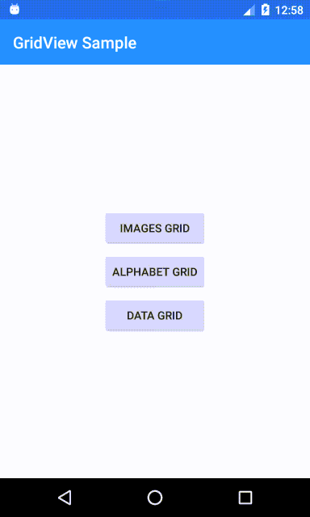

# Xamarin Forms GridView



More screenshots:   
[GridView with images](Screenshots/Screenshot_1526994445.png)  
[GridView with alphabet characters](Screenshots/Screenshot_1526994471.png)  
[GridView as DataGrid - 1](Screenshots/device-182739.png)  
[GridView as DataGrid - 2](Screenshots/device-182750.png)  

***

This is Android Adapter Pattern GridView in the Xamarin Forms, which simply takes your list of the data and convert into the grid pattern as like in android. you just need to pass the item count and root view of your cell.

## Installation

This GridView code added into your xamarin form project and rebuild project. For, the more information refer this [`XamGridView`](XamGridView/) sample project.  

## Usage

Here's an example of code to write custom adapter class of the GridView and how to use adapter pattern in the xamarin forms. 
You can see the complete code sample [here](XamGridView/XamGridView/):

Custom adapter class of the GridView which is extende the abstract class GridAdapter and need to implements this three methods.
You can see the code of this file [here](XamGridView/XamGridView/Adapter/Images/ImagesGridAdapter.cs):

```C#
public class ImagesGridAdapter : GridAdapter	
{    
    private List<string> lstImages;    

    public ImagesGridAdapter(List<string> lstImages)    
    {    
        this.lstImages = lstImages;    
    }    

    public override int GetCount()    
    {    
        return lstImages.Count;    
    }    

    public override object GetItem(int position)    
    {    
        return lstImages[position];    
    }    

    public override View GetView(int position, View convertView, View parentView)    
    {    
        ImagesGridViewHolder holder;    

        if (convertView == null)    
        {    
            holder = new ImagesGridViewHolder();    
            convertView = holder.getRootView();    
            convertView.BindingContext = holder;    
        }    
        else    
        {    
            holder = (ImagesGridViewHolder)convertView.BindingContext;    
        }    

        //.....    

        return convertView;    
    }    
}    
```

Xamarin does not have layout inflater facility so, need to manually write grid cell code which is our view holder class.
You can see the code of this file [here](XamGridView/XamGridView/Adapter/Images/ImagesGridViewHolder.cs):

```C#
public class ImagesGridViewHolder
{
    public Image img;

    public ImagesGridViewHolder()
    {
        img = new Image();
        img.Aspect = Aspect.Fill;
    }

    // To get the root view of the your cell
    public View getRootView()
    {
        return img;
    }
}
```

**XAML:**

First add the xmlns namespace:
```xml
xmlns:grid="clr-namespace:DLab.Views;assembly=DLab.GridView"
```

Then add this sample xaml code:

```xml
<StackLayout>
    <grid:GridView x:Name="gridLayout" 
          NumColumns="3" 
          ScrollToEnd="False" 
          Padding="5,5,5,5" />
</StackLayout>
```

```C#
ImagesGridAdapter adapter = new ImagesGridAdapter(lstImages);
// always first initialize tap event then after pass the item source
gridLayout.ItemTapped += Handle_TapEvent;
gridLayout.ItemSource = adapter;
```

**Event:**

```C#
private void Handle_TapEvent(object s, GridEventArgs arg)
{
    Device.BeginInvokeOnMainThread(() =>
    {
        // get the selected view holder from the Event arguments
        // arg.view.BindingContext => to get the ViewHolder
        // arg.position
    });
}
```

## Bindable Properties

|Properties|Version|Description
| :-------------------  | :------------------: | :------------------- |
|NumColumns|1.0| How many columns are required, minimum 1 and default 3
|ScrollToEnd|1.0| If true then automatically scrolling view else not, default false
|ColumnSpacing|1.0| To give the space between two column, default 6.0
|RowSpacing|1.0| To give the space between two row, default 6.0

## Update GridView

It does not follow the observing pattern so when you do change in your list, you need to notify view using this methods `NotifyDataSetChanged()` or `NotifyDataSetChanged(int position)`. For, more information refer this code sample [here](XamGridView/XamGridView/Adapter/Alphabet/AlphabetGridAdapter.cs):

## Small Print

### Current issues

* GridView cell not support animations when initialize
* If TapEvent initialize after ItemSource then it is consider as null so, event not detects

### Contributing

Contributions are welcome! If you find a bug please report it and if you want add new feature then please suggest to me. If you want to contribute code please file an issue and create a branch off of the current dev branch and file a pull request.

### About me

Kishan Donga ([@ikishan92](https://twitter.com/ikishan92))  
I am android developer so that's why I develope this GridView in the adapter pattern.

### License

`Xamarin-GridView` is released under the MIT license.